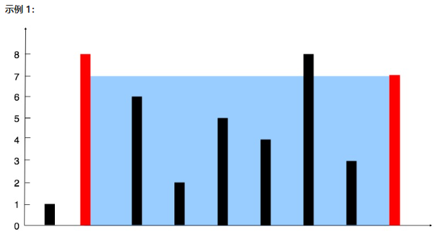

# 盛最多水的容器

- 给定一个长度为 n 的整数数组 height 。有 n 条垂线，第 `i` 条线的两个端点是 `(i, 0)` 和 `(i, height[i])` 。
- 找出其中的两条线，使得它们与 x 轴共同构成的容器可以容纳最多的水。
- 返回容器可以储存的最大水量。
- 说明：你不能倾斜容器。

**示例1**

```
输入：[1,8,6,2,5,4,8,3,7]
输出：49 
解释：图中垂直线代表输入数组 [1,8,6,2,5,4,8,3,7]。在此情况下，容器能够容纳水（表示为蓝色部分）的最大值为 49。
```




**示例 2：**

```
输入：height = [1,1]
输出：1
```

```java
package com.stanlong.leetcode;

/**
 * 盛最多水的容器
 * 解法一：双指针
 */
public class LeetCode {

    public static void main(String[] args) {
        Solution solution = new Solution();
        int[] height = {10,9,8,7,6,5,4,3,2,1};
        int result = solution.maxArea(height);
        System.out.println(result);
    }
}

class Solution{
    public int maxArea(int[] height){
        int len = height.length;
        int left = 0;
        int right = len - 1;
        int result = Integer.MIN_VALUE;
        while (left < right){
            result = Math.max(result, (right-left) * Math.min(height[left], height[right]));
            if(height[left] < height[right]){
                left++;
            }else {
                right--;
            }
        }
        return result;
    }
}
```

```java
package com.stanlong.leetcode;

/**
 * 盛最多水的容器
 * 解法二， 提供一种思路，leetcode上超时了。
 */
public class LeetCode {

    public static void main(String[] args) {
        Solution solution = new Solution();
        int[] height = {10,9,8,7,6,5,4,3,2,1};
        int result = solution.maxArea(height);
        System.out.println(result);
    }
}

class Solution{
    public int maxArea(int[] height){
        int len = height.length;
        int res = 0;
        for(int i = 0; i < len - 1; i++) {
            for(int j = i + 1; j < len; j++) {
                int a = height[i];
                int b = height[j];
                int c = j - i;
                if (a > b){
                    if (res < b * c)
                        res = b * c;
                }else{
                    if (res < a *c)
                        res = a * c;
                }
            }
        }
        return res;
    }
}
```

