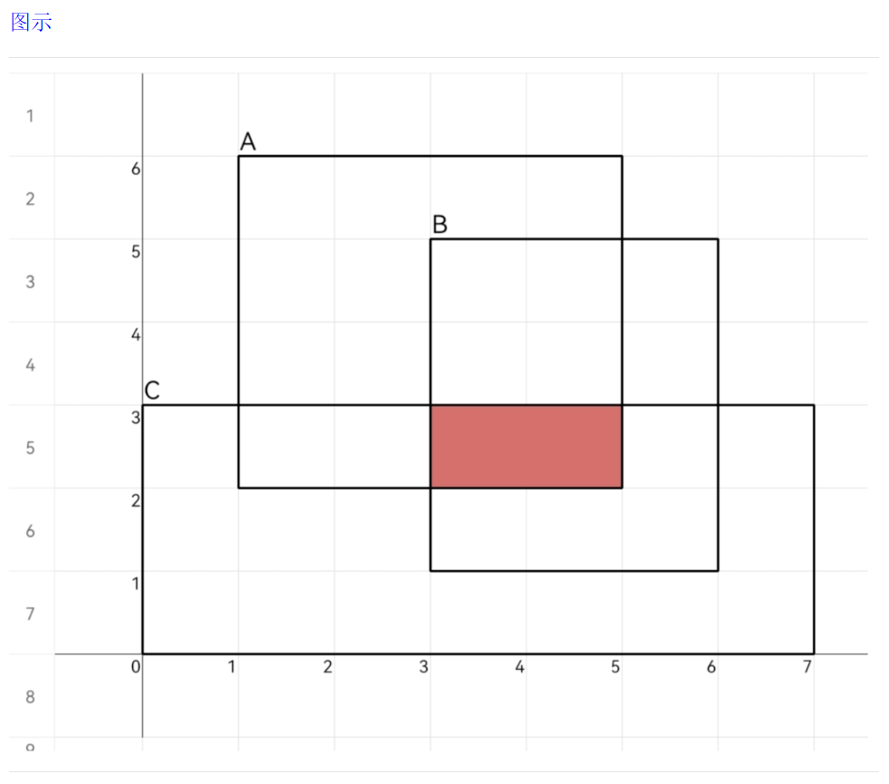

# 矩形相交的面积

**题目描述**

- 给出3组点坐标(x, y, w, h)，-1000<x,y<1000，w,h为正整数。
- (x, y, w, h)表示平面直角坐标系中的一个矩形：
- x, y为矩形左上角坐标点，w, h**向右w**，**向下h**。
- (x, y, w, h)表示x轴(x, x+w)和y轴(y, y-h)围成的矩形区域；
- (0, 0, 2, 2)表示 x轴(0, 2)和y 轴(0, -2)围成的矩形区域；
- (3, 5, 4, 6)表示x轴(3, 7)和y轴(5, -1)围成的矩形区域；
- 求3组坐标构成的矩形区域重合部分的面积。

**输入描述**

3行输入分别为3个矩形的位置，分别代表“左上角x坐标”，“左上角y坐标”，“矩形宽”，“矩形高” -1000 <= x,y < 1000

**输出描述**

输出3个矩形相交的面积，不相交的输出0。

**示例1**

```
输入

1 6 4 4
3 5 3 4
0 3 7 3

输出
2
```

