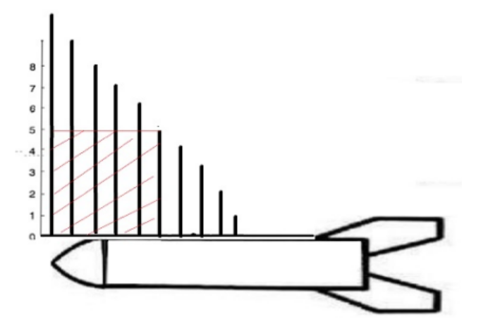

# 太阳能板最大面积

给航天器一侧加装长方形或正方形的太阳能板（图中的红色斜线区域），需要先安装两个支柱（**图中的黑色竖条**），再在支柱的中间部分固定太阳能板。但航天器不同位置的支柱长度不同，太阳能板的安装面积受限于**最短一侧**的那根支柱长度。如图：



现提供一组整形数组的支柱高度数据，假设每根支柱间距离相等为1个单位长度，计算如何选择两根支柱可以使太阳能板的面积最大。

**输入描述:**

- 10,9,8,7,6,5,4,3,2,1
- 注：支柱至少有2根，最多10000根，能支持的高度范围1~10^9的整数。柱子的高度是无序的，例子中递减只是巧合。

**输出描述:**

- 可以支持的最大太阳能板面积：（10米高支柱和5米高支柱之间）
- 25

**示例1**

```
输入： 10,9,8,7,6,5,4,3,2,1
输出： 25

说明：
- 10米高支柱和5米高支柱之间宽度为5，高度取小的支柱高也是5，面积为25。
- 任取其他两根支柱所能获得的面积都小于25。
- 所以最大的太阳能板面积为25。
```

**解法一**

```java
package com.stanlong.leetcode;

import java.util.Scanner;

/**
 * 太阳能电池版最大面积
 */
public class LeetCode {

    public static void main(String[] args) {
        Scanner sc = new Scanner(System.in);
        String[] strs = sc.nextLine().split(",");
        int len = strs.length;
        long res = 0;
        for(int i = 0; i < len - 1; i++) {
            for(int j = i + 1; j < len; j++) {
                long a = Long.parseLong(strs[i]);
                long b = Long.parseLong(strs[j]);
                long c = j - i;
                if (a > b){
                    if (res < b * c)
                        res = b * c;
                }else{
                    if (res < a *c)
                        res = a * c;
                }
            }
        }
        System.out.print(res);
    }
}
```

**解法二**

```
对O(n)的算法写一下自己的理解，一开始两个指针一个指向开头一个指向结尾，此时容器的底是最大的，接下来随着指针向内移动，会造成容器的底变小，在这种情况下想要让容器盛水变多，就只有在容器的高上下功夫。 那我们该如何决策哪个指针移动呢？我们能够发现不管是左指针向右移动一位，还是右指针向左移动一位，容器的底都是一样的，都比原来减少了 1。这种情况下我们想要让指针移动后的容器面积增大，就要使移动后的容器的高尽量大，所以我们选择指针所指的高较小的那个指针进行移动，这样我们就保留了容器较高的那条边，放弃了较小的那条边，以获得有更高的边的机会。
-- https://leetcode.cn/u/liang-chen-5/
```

```java
package com.stanlong.leetcode;

/**
 * 太阳能板最大面积
 */
public class LeetCode {

    public static void main(String[] args) {
        Solution solution = new Solution();
        int[] height = {10,9,8,7,6,5,4,3,2,1};
        int result = solution.maxArea(height);
        System.out.println(result);
    }
}

class Solution{
    public int maxArea(int[] height){
        int len = height.length;
        int left = 0;
        int right = len-1;
        int result = Integer.MIN_VALUE;
        while (left<right){
            result = Math.max(result, (right-left)*Math.min(height[left], height[right]));
            if(height[left] > height[right]){
                --right;
            }else {
                ++left;
            }
        }
        return result;
    }
}
```

